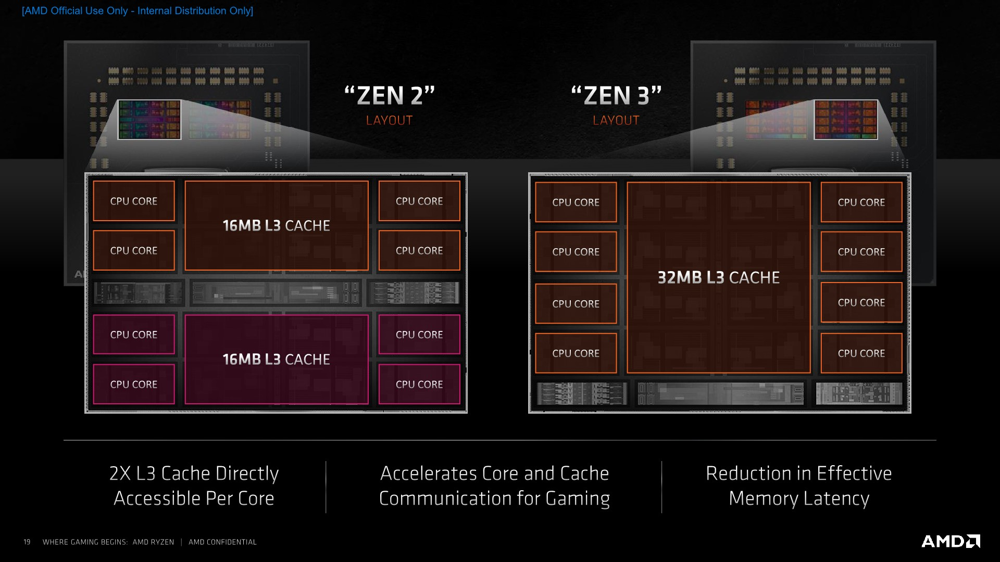
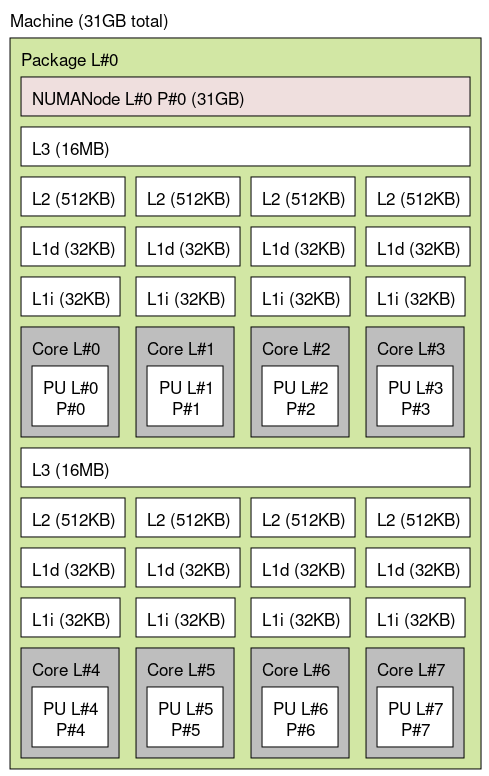
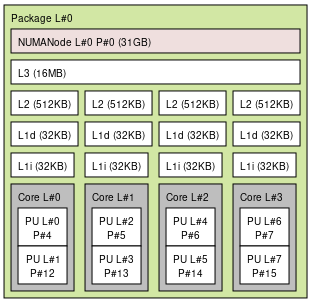
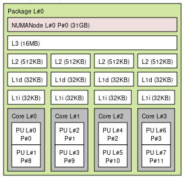

# A linux gaming guide

This is some kind of guide/compilation of things, that I got to do/learn about while on my journey of gaming on linux. I am putting it here so it can be useful to others! If you want to see something added here, or to correct something where I am wrong, you are welcome to open an issue or a PR ! 

## Table of Content

<!-- @import "[TOC]" {cmd="toc" depthFrom=1 depthTo=6 orderedList=false} -->

<!-- code_chunk_output -->

- [A linux gaming guide](#a-linux-gaming-guide)
  - [Table of Content](#table-of-content)
  - [Linux distribution](#linux-distribution)
  - [Lutris](#lutris)
  - [DXVK](#dxvk)
  - [GPU](#gpu)
    - [Nvidia](#nvidia)
    - [AMD](#amd)
      - [Mesa / RADV](#mesa--radv)
        - [Profile Guided Optimisations](#profile-guided-optimisations)
  - [Kernel](#kernel)
    - [Game mode](#game-mode)
    - [AMD Ryzen: the `cpuset` trick](#amd-ryzen-the-cpuset-trick)
      - [A small intro to CPU cache](#a-small-intro-to-cpu-cache)
      - [What can we do with this information ?](#what-can-we-do-with-this-information-)
      - [Using `cpuset`](#using-cpuset)
      - [Benchmark](#benchmark)
  - [Wine](#wine)
    - [Environment variables](#environment-variables)
    - [Wine-tkg: compiler optimisations](#wine-tkg-compiler-optimisations)
  - [X11/Wayland](#x11wayland)
  - [Performance overlays](#performance-overlays)
  - [Streaming - Saving replays](#streaming---saving-replays)
    - [OBS](#obs)
      - [Using `cpuset` with software encoder on Ryzen CPUs](#using-cpuset-with-software-encoder-on-ryzen-cpus)
      - [Gnome](#gnome)
    - [Replay sorcery](#replay-sorcery)
    - [Stream only the game sounds](#stream-only-the-game-sounds)
  - [Mic noise suppression](#mic-noise-suppression)
  - [Game render tweaks: vkBasalt](#game-render-tweaks-vkbasalt)
  - [Compositor / desktop effects](#compositor--desktop-effects)
  - [Benchmarks](#benchmarks)
  - [Misc](#misc)

<!-- /code_chunk_output -->


## Linux distribution

I have seen many reddit posts asking which linux distributions is "best" for gaming. My thoughts on the matter is that, to get the best performance, one simply needs the latest updates. All linux distributions provide the sames packages and provide updates. Some provide them faster than others. So any distribution that updates its packages the soonest after upstream (aka the original developpers), is good in my opinion. Some distributions can take longer, sometimes 6 months after, for big projects (which is acceptable too, since one would get the updates without the initial bugs).

## Lutris

Lutris is some kind of open source Steam that helps with installing and running some games. Each game has its own install script, maintained by usually different people (as far as I understand).
I have only used Lutris, to install and run Overwatch, I don't think there's room for improvement in here since Lutris is just here to run overwatch with a chosen Wine version and environment variables. Correct me if I am wrong.

Some useful settings:
* Enable FSYNC (if you have a patched custom kernel, further information below) otherwise enable ESYNC: once overwatch is installed, go to "Configure" > "Runner Options" > Toggle FSYNC or ESYNC.

## DXVK

This is the library that maps DirectX (Windows) to Vulkan (Multi-platform and open source) so games that are meant for Windows work on Linux. It's better than wine's built-in mapper called WineD3D. Lutris provides a version already. 

You can compile your own latest one with some "better" compiler optimizations if you wish, and that's what I am doing but I have no idea about the possible FPS benefits of doing that. To do so you will need to put what DXVK's compile script gives you in `~/.local/share/lutris/runtime/dxvk/`. Link here: https://github.com/doitsujin/dxvk

```shell
git clone https://github.com/doitsujin/dxvk.git
cd dxvk
# Build new DLLS
./package-release.sh master ~/.local/share/lutris/runtime/dxvk/ --no-package
```
To use more aggressive compiler optimisations, one can edit `build-win32.txt` and `build-win64.txt` and change the following before running the `./package-release.sh` script:
```
c_args=['-march=native', '-O3', '-pipe', '-flto', '-floop-strip-mine', '-fno-semantic-interposition', '-fipa-pta', '-fdevirtualize-at-ltrans']
cpp_args=['-march=native', '-O3', '-pipe', '-flto', '-floop-strip-mine', '-fno-semantic-interposition', '-fipa-pta', '-fdevirtualize-at-ltrans']
c_link_args = ['-flto', '-static', '-static-libgcc']
cpp_link_args = ['-flto', '-static', '-static-libgcc', '-static-libstdc++']
```
These may improve performance or not, the best is to test with and without and see for oneself. If regressions happen, first try removing the `-flto` option, then change the `-O3` to `-O2`, then remove `-march=native`. And if after all this it still doesn't work, just go back to the original settings.

Then you go in Lutris and tell it to use this version of dxvk: "Configure" > "Runner Options" > "DXVK Version" and put `dxvk-master`

## GPU

1. Update to the latest possible driver for your GPU
2. If you are hesitating between AMD and Nvidia for your next GPU buy. As far as Linux is concerned: AMD all the way, because they are way more supported since they give out an open source driver.

### Nvidia

The least one can do is redirect to Arch's documentation about it: https://wiki.archlinux.org/index.php/NVIDIA

If you didn't install the proprietary driver your computer is likely to be running an open source driver called `nouveau`, but you wouldn't want that to play games with that as it works based off reverse engineering and doesn't offer much performance.

Once you have the proprietary driver installed, open `nvidia-settings`, make sure you have set your main monitor to its maximum refresh rate and have 'Force Full Composition Pipeline' disabled (advanced settings).

Also, in Lutris, you can disable the size limit of the NVidia shader cache by adding `__GL_SHADER_DISK_CACHE_SKIP_CLEANUP=1` to the environement variables.

### AMD
A nice documentation is given by, once again, Arch's documentation: https://wiki.archlinux.org/index.php/AMDGPU

* "Very old" GPUs: the opensource driver is `radeon` and you only have that as an option, along with AMD's closed source driver I believe. But you are out of luck for running DXVK, since both driver's don't implement Vulkan.
* "Old" GPUs: GCN1 and GCN2 are now supported by the newer "amdgpu" driver and you switch to it to win a few frames.
* New GPUs: the base driver is `amdgpu`, and is shipped and updated with the linux Kernel, stacks on top of it three different drivers: 
  * Mesa: the open source graphics stack that handles AMD, Intel, Qualcomm ...etc GPUs. The AMD OpenGL driver is called RadeonSI Gallium3D and is the best you can get. The Vulkan driver is called RADV
  * amdvlk: AMD's official open source Vulkan-only driver, I suppose the rest (OpenGL) is left to mesa. link here: https://github.com/GPUOpen-Drivers/AMDVLK
  * amdgpu PRO: AMD's official closed source driver, that has its own Vulkan and OpenGL implementation. 

#### Mesa / RADV

If you are running RADV and with a mesa version prior to 20.2, you should consider trying out ACO as it makes shader compilation (which happens on the CPU) way faster : go to "Configure" > "System Options" > Toggle ACO.

Your distro ships the latest stable version, you can go more bleeding edge to get the latest additions, but keep in mind that regressions often come with it. On Ubuntu there's a [PPA](https://launchpad.net/~oibaf/+archive/ubuntu/graphics-drivers) that gives out the latest mesa, and another [PPA](https://launchpad.net/~kisak/+archive/ubuntu/kisak-mesa) that's less bleeding edge/more stable . Otherwise you can compile only RADV by hand with the extra bonus of using "agressive" compiler optimisations (`-march=native`, `-O3`, and LTO and PGO) and use it for any Vulkan game, in a per game basis:

```shell
git clone --depth=1 https://gitlab.freedesktop.org/mesa/mesa.git
cd mesa
mkdir build && cd build
export CFLAGS="-march=native -O3 -pipe"
export CXXFLAGS="${CFLAGS}"
meson .. \
    -D prefix="$HOME/radv-master" \
    --libdir="$HOME/radv-master/lib" \
    -D b_ndebug=true \
    -D b_lto=true \
    -D b_pgo=off \
    -D buildtype=release \
    -D platforms=x11,wayland \
    -D dri-drivers= \
    -D gallium-drivers= \
    -D vulkan-drivers=amd \
    -D gles1=disabled \
    -D gles2=disabled \
    -D opengl=false
meson configure
ninja install
```
And here again, if you feel even more adventurous, you can go for this set of compiler flags:
```shell
export CFLAGS="-march=native -O3 -pipe -flto -floop-strip-mine -fno-semantic-interposition -fipa-pta -fdevirtualize-at-ltrans"
export CXXFLAGS="${CFLAGS}"
export LDFLAGS="-flto"
```
These may improve performance or not, the best is to test with and without and see for oneself. If regressions happen, or it doesn't succeed in the compile step. First try removing the `-flto` option, then change the `-O3` to `-O2`, then remove `-march=native`. And if after all this it still doesn't work, just go back to the original settings (aka without the `export` lines).

After running the lines above, you get the driver installed in `$HOME/radv-master`. Now, to use it for Overwatch (or any other game), you go to "Configure" > "System Options" > Environment variables and add the following line:

```
VK_ICD_FILENAMES=$HOME/radv/share/vulkan/icd.d/radeon_icd.x86_64.json:$OTHER_PATH/radeon_icd.i686.json
```
where you should manually replace `$HOME` by your home path `/home/Joe` and `$OTHER_PATH` by where `radeon_icd.i686.json` actually is, you can find out with
```
sudo updatedb
locate radeon_icd.i686.json
```
If the games crashes after doing all this, you can either try other git commits (you will need some git knowledge) or revert to the stable driver by simply removing the `VK_ICD_FILENAMES` environment variable. And if you don't wanna hear about bleeding edge mesa anymore you can simply remove the `mesa` folder along with `$HOME/radv-master`.

##### Profile Guided Optimisations

One can actually go even further in the compiler optimisations, by using this so called [Profile Guided Optimisations](https://en.wikipedia.org/wiki/Profile-guided_optimization). The idea behind is to produce a first version of the driver, with performance counters added in (that slow it down qute a bit). Use the driver in real life use-cases to retrieve useful statistics. Then use those statistics to compile a final, improved version, of the driver.

For what will follow, I suppose that the fist clone step has already been done, and the source code is in the `mesa` folder.

**Step 1: Profiling data generation** 

```shell
cd path/to/mesa
git clean -f -d -x
mkdir build && cd build
export CFLAGS="-march=native -O3 -pipe -flto -floop-strip-mine -fno-semantic-interposition -fipa-pta -fdevirtualize-at-ltrans -fprofile-generate=pgo-generate"
export LDFLAGS="-flto -fprofile-generate=pgo-generate"
export CXXFLAGS="${CFLAGS}"
meson .. \
    -D prefix="$HOME/radv-master-pgogen" \
    --libdir="$HOME/radv-master-pgogen/lib" \
    -D b_ndebug=true \
    -D b_lto=true \
    -D b_pgo=generate \
    -D b_coverage=true \
    -D buildtype=release \
    -D platforms=x11,wayland \
    -D dri-drivers= \
    -D gallium-drivers= \
    -D vulkan-drivers=amd \
    -D gles1=disabled \
    -D gles2=disabled \
    -D opengl=false
meson configure
ninja install
```

This will generate the driver in the folder `$HOME/radv-master-pgogen`, what we need to do next is to tell lutris to use it by changing, in Lutris "Configure" > "System Options" > Environment variables and add/edit the following line:

```shell
VK_ICD_FILENAMES=$HOME/radv-master-pgogen/share/vulkan/icd.d/radeon_icd.x86_64.json:$OTHER_PATH/radeon_icd.i686.json
```
where you should manually replace `$HOME` by your home path `/home/Joe` and `$OTHER_PATH` by where `radeon_icd.i686.json` actually is, you can find it out by following the explanations above. After that, open and play the game for a while, let's say an hour. The game will generate some statistics files in the folder `pgo-generate` that is located at the same directory where the game's executable is located. Copy the folder to the home folder:

```shell
cp path/to/game/executable/pgo-generate ~/pgo-generate
```

**Step 2: Use the profiling data**

We expect that profiling data is in the folder `~/pgo-generate`
```shell
export CFLAGS="-march=native -O3 -pipe -flto -floop-strip-mine -fno-semantic-interposition -fipa-pta -fdevirtualize-at-ltrans -fprofile-use=/home/Joe/pgo-generate -fprofile-partial-training"
export LDFLAGS="-flto -fprofile-use=/home/Joe/pgo-generate"
export CXXFLAGS="${CFLAGS}"
meson .. \
    -D prefix="$HOME/radv-master-pgo" \
    --libdir="$HOME/radv-master-pgo/lib" \
    -D b_ndebug=true \
    -D b_lto=true \
    -D b_pgo=use \
    -D buildtype=release \
    -D platforms=x11,wayland \
    -D dri-drivers= \
    -D gallium-drivers= \
    -D vulkan-drivers=amd \
    -D gles1=disabled \
    -D gles2=disabled \
    -D opengl=false
meson configure
ninja install
```
Where `Joe` in `-fprofile-use=/home/Joe/pgo-generate` should be changed to your username. The driver will be located in `$HOME/radv-master-pgo`, what we need to do next is to tell lutris to use it by changing, in Lutris "Configure" > "System Options" > Environment variables and add/edit the following line:

```shell
VK_ICD_FILENAMES=$HOME/radv-master-pgogen/share/vulkan/icd.d/radeon_icd.x86_64.json:$OTHER_PATH/radeon_icd.i686.json
```
where you should manually replace `$HOME` by your home path `/home/Joe` and `$OTHER_PATH` by where `radeon_icd.i686.json` actually is, you can find it out by following the explanations above.
## Kernel

First, try to get the latest kernel your distro ships, it often comes with performance improvements (it contains the base updates for the amd gpu driver for example).

Otherwise, this is something not many touch, but using a self-compiled one can bring some small improvements. There is a git project called [linux-tkg](https://github.com/Frogging-Family/linux-tkg), which provides a script that compiles the linux Kernel from sources (takes about ~30mins) with some customization options : the default [scheduler](https://en.wikipedia.org/wiki/Scheduling_(computing)) ([CFS](https://en.wikipedia.org/wiki/Completely_Fair_Scheduler)) can be changed to other ones (Project C UPDS, PDS, BMQ, MuQSS) and can recieve the so called ["FSYNC"](https://steamcommunity.com/games/221410/announcements/detail/2957094910196249305) patch. Both of these can help getting better performance in games. And also other patches. Linux-tkg needs to be compiled on your own machine (where you can use compiler optimisations such as `-O3` and `-march=native`) with an interactive script and a config file, I worked on the script to install on Ubuntu and Fedora. link here: https://github.com/Frogging-Family/linux-tkg

For a less efforts solution, you can look up Xanmod kernel, Liquorix, Linux-zen. That provide precompiled binaries.

### Game mode

It's a small program that puts your computer in performance mode: as far as I know it puts the frequency scaling algorithm to `performance` and changes the scheduling priority of the game. It's available in most distro's repositories and I believe it helps in giving consistent FPS. Lutris uses it automatically if it's detected, otherwise you need to go, for any game in Lutris, to "Configure" > "System Options" > "Environment variables" and add `LD_PRELOAD="$GAMEMODE_PATH/libgamemodeauto.so.0"` where you should replace `$GAMEMODE_PATH` with the actual path (you can do a `locate libgamemodeauto.so.0` on your terminal to find it). Link here: https://github.com/FeralInteractive/gamemode.

You can check whether or not gamemode is running with the command `gamemoded -s`. For GNOME users, there's a status indicator shell extension that show a notification and a tray icon when gamemode is running: https://extensions.gnome.org/extension/1852/gamemode/


### AMD Ryzen: the `cpuset` trick

#### A small intro to CPU cache
The cache is the closest memory to the CPU, and data from RAM needs to go through the cache first before being processed by the CPU. The CPU doesn't read from RAM directly. This cache memory is very small (at maximum few hundred megabytes as of current CPUs) and this leads to some wait time in the CPU: when some data needs to be processed but isn't already in cache (a "cache miss"), it needs to be loaded in RAM. When the cache is "full", because it will always be, some "old" data in cache is synced back in RAM then deleted to give some space to the new needed data. This takes time.

There is usually 3 levels of cache memory in our CPUs: L1, L2, and L3. In Ryzen, the L1 and L2 are few hundred kilobytes and the L3 a (few) dozen megabytes. Each core has its own L1 and L2 cache, the L3 is shared: in zen/zen+/zen2 it is shared among each 4 cores (called a CCX). and CCX'es are groupped two by two in what is called CCDs. In zen 3, the L3 cache is shared  among the cores of an entire CCD, 8 cores. There's [this anandtech article](https://www.anandtech.com/show/16214/amd-zen-3-ryzen-deep-dive-review-5950x-5900x-5800x-and-5700x-tested/4) that gives a through analysis of cache topology in Zen 2 vs Zen 3:



One can obtain the cache topology if his current machine by running the following command:
```shell
$ lstopo
```

The lstopo of my Ryzen 3700X gives this



#### What can we do with this information ?
Something really nice: give an entire CCX (or CCD for Zen3, if you have more than one CCD) to your game, and make (nearly) everything else run in the other CCX(s)/CCD(s). With this, as far as I can hypothesize, one reduces the amount of L3 cache misses for the game, since it doesn't share it with no other app. The really nice thing with this, that you can notice easily, is that if you run a heavy linux kernel compilation on the other CCX(s)/CCD(s) your game is less affected: you can test for yourself. I think that using this trick also downplays the role a scheduler has on your games, since the game is alone and very few other things run with it on the same cores (like wine and the kernel).
#### Using `cpuset`

[cpuset](https://www.kernel.org/doc/html/latest/admin-guide/cgroup-v1/cpusets.html) is a linux mechanism to create groups of cores (a cpu set) to which you can assign processes, at runtime. One can use it to create two cpu sets: one for your game, another for all the rest. Have a read at the doc to understand how things work. I may update things here to explain further.

[I made a script](./scripts/tasks_redirect.sh) that does so for a Ryzen 3700X, that has 8 cores, 16 threads: logical cores 0-3,8-11 (given in the `P#` in the `lstopo` result) or assigned to a set that I called `theUgly`, which are associated to 4 physical cores (with SMT) in CCX0. Cores 4-7,12-15 are assigned to `theGood` in CCX1. Then it redirects `lutris` to the `theGood` cpuset, `lutris` will then launch wine and the game in the same cpuset automatically. You can edit the script to fit with your current CPU, after having a look at what `lstopo` outputs and at the cpuset documentation. Created cpu sets can be removed if they get redirected to the main cpuset that contains all cores, [I made that script too](./scripts/reverse_tasks_redirect.sh), for my own CPU.

**important:** core IDs should be carefully chosen so the cpu sets are separated by CCX/CCD and not just make a non hardware aware split (a recent AMD BIOS update changed the core naming scheme to fit with what Intel does), one way to verify it is, after doing the splitting, to call `lstopo` in both cpusets and verify. A way to do so is to move one shell to the new group, as root:

```shell
/bin/echo $$ >> /dev/cpuset/theGood/tasks
lstopo
```


Then also open another shell, and do `lstopo`, you should get separate results:



#### Benchmark
I did [this benchmark](#overwatch-cpuset) on Overwatch, the conclusions are the following:
- After a fresh restart, I already have a small number of processes (around 300), and most of them are sleeping, which means that Overwatch basically already has the entirety of the CPU for itself. Doing the cpuset trick reduced the performance: I think it's because Overwatch works optimally in more than 4 cores.
- Playing while doing another heavy workload, like stream with software encoding, works better with the cpuset trick.
## Wine

Wine can have quite the impact on games, both positive and negative. Latest wine from Lutris works fine. You can give a try to [wine-tkg](https://github.com/Frogging-Family/wine-tkg-git), it offers quite the amount of performance patches and, for overwatch, improve the game's performance.

### Environment variables

Some [wine environment variables](https://wiki.winehq.org/Wine-Staging_Environment_Variables#Shared_Memory) can be set that can help with performance, given that they can break games, they can be added on a per-game basis as usual in Lutris. The variables are the following:

```shell
STAGING_SHARED_MEMORY=1
STAGING_WRITECOPY=1
```

### Wine-tkg: compiler optimisations

On top of the config variables that can be toggled in `customization.cfg` in wine-tkg, I run wine-tkg with the following compiler optimisations, that can be added in the `wine-tkg-profiles/advanced-customization.cfg` file, `AVX` instruction set seems to cause problems for me:

```shell
_GCC_FLAGS="-O3 -march=native -mno-avx -pipe -floop-strip-mine -fno-semantic-interposition -fipa-pta -fdevirtualize-at-ltrans"
# Custom LD flags to use instead of system-wide makepkg flags set in /etc/makepkg.conf. Default is "-pipe -O2 -ftree-vectorize".
_LD_FLAGS="-Wl,-O1,--sort-common,--as-needed"
# Same as _GCC_FLAGS but for cross-compiled binaries.
_CROSS_FLAGS="-O3 -march=native -mno-avx -pipe -floop-strip-mine -fno-semantic-interposition -fipa-pta -fdevirtualize-at-ltrans"
# Same as _LD_FLAGS but for cross-compiled binaries.
_CROSS_LD_FLAGS="-Wl,-O1,--sort-common,--as-needed"
```


## X11/Wayland

I use only X11 for now, and works nicely. Wayland is not as good as X11 for now, for gaming (the desktop smoothness is better than x11 though, with AMD GPUs), except if you want to try a custom wine with Wayland patches: https://github.com/varmd/wine-wayland. I am unable to run Overwatch with it yet. In terms of input lag LXDE seems to be better for me than Gnome. Feel free to try for yourself!

## Performance overlays

Performance overlays are small "widgets" that stack on top of your game view and show performance statistics (framerate, temperatures, frame times, CPU/RAM usages... etc). Two possibilities:

* MangoHud: It is available in the repositories of most linux distros, to activate it, you only need to add the environment variable `MANGOHUD=1`, and the stats you want to see in `MANGOHUD_CONFIG`. The interesting part of MangoHud is that it can also bechmark games: Record the entirety of the frame times, calculate frametime percentiles...etc Ideal to do benchmarks with. More information here: https://github.com/flightlessmango/MangoHud. It can be configured via a GUI with GOverlay - https://github.com/benjamimgois/goverlay
* DXVK has its own HUD and can be enabled by setting the variable `DXVK_HUD`, the possible values are explained in [its repository](https://github.com/doitsujin/dxvk)

## Streaming - Saving replays

### OBS

[OBS](https://obsproject.com/) is the famous open source streaming software, it works nicely with X11 on AMD GPUs, especially LXDE (when compared to Gnome) I feel no added input lag with LXDE. The video quality is actually better than Windows, since you can use VAAPI-FFMPEG on Linux, and it has a better video quality than the AMD thingy on windows. Nvidia has been reported to work nicely on linux and on windows with their new NVENC thing.

#### Using `cpuset` with software encoder on Ryzen CPUs

If you can't use your own GPU for encoding or prefer to use a software encoder, it's a very good idea to se the `cpuset` trick explained above to not affect your game's performance by running OBS in a different CCX/CCD. I tried it and it makes a huge difference.

#### Gnome

On Gnome, an experimental feature can be enabled: 
```shell
gsettings set org.gnome.mutter experimental-features '["dma-buf-screen-sharing"]'
```
That will enable `zero-copy` game capture, which noticeably reduces the added input lag added by the game capture for streaming. A beta version of `Obs-studio` should then be used, it can be installed via `flatpak`
```shell
flatpak install --user https://flathub.org/beta-repo/appstream/com.obsproject.Studio.flatpakref
```
Then it can be run with an environment variable, `OBS_USE_EGL=1`:
```shell
OBS_USE_EGL=1 com.obsproject.Studio
```
where `com.obsproject.Studio` is the name of the `obs-studio` executable, installed through flatpak, it may have another name in your specific distro.

**Some open Issues I have been having**
- __Network Error on Twitch:__ Lately I've been getting network error on twitch when I switch between video sources (Desktop to Overwatch), I couldn't get help on it and I still can't figure out what the issue is... If you have any ideas please reach out!
- __Decoding crashes__: Viewers on windows reporting that their decoder is crashing when watching my stream, I have no idea why. I think it's an FFMPEG-VAAPI thing.

### Replay sorcery

[Replay sorcery](https://github.com/matanui159/ReplaySorcery) is a tool to save small replays of your gaming sessions, without the need to be streaming. It saves a "video" of your play for the past `x` seconds in RAM: it is saved as sequence of JPEG images (small footprint on the computer's ressources). And these images are only converted to a video when you want to actually save a replay (more ressource heavy). I haven't given it a try, if you want to add hints and tips about it, please feel free to PR something or open an issue!

### Stream only the game sounds

You are in a Discord call and streaming at the same time, but you only want OBS to stream the game's sounds ? Search no more. The solution is here (that I found [here](https://unix.stackexchange.com/questions/384220/how-to-create-a-virtual-audio-output-and-route-it-in-ubuntu-based-distro)): the idea is to create some kind of virutal soundcard, let's call it `Game-Sink`, where the game will output it sound on. Then you redirect the sound from `Game-Sink` to your actual soundcard.

Create `Game-Sink`:
```shell
pacmd load-module module-null-sink sink_name=game_sink sink_properties=device.description=Game-Sink
```
Find the actual name of `$OriginalSoundcard`: you do this command and look at its output, you should recognize your card's name there:
```shell
pacmd list-sinks | grep name:
```
For example, for me I have a SteelSeries Arctis PRO with the Game DAC (with cable), the name of my card is `alsa_output.usb-SteelSeries_SteelSeries_GameDAC_000000000000-00.iec958-stereo`. So here's how you do the loopback from `Game-Sink`:
```shell
pacmd load-module module-loopback source="game_sink.monitor" sink="alsa_output.usb-SteelSeries_SteelSeries_GameDAC_000000000000-00.iec958-stereo"
```
Then, all what's left is to do is to open `pavucontrol` (google how to install it if you don't have it) and select `Game-Sink` for where `obs-studio` picks its audio from. And select `Game-Sink` for where the game outputs its audio to.

## Mic noise suppression

You have cherry blue mechanical keyboard, your friends and teammates keep on complaining/sending death threats about you being too noisy with your keyboard ? Fear no more.

**A bit of history:** People from Mozilla made some research to apply neural networks to noise suppression from audio feeds, they [published](https://jmvalin.ca/demo/rnnoise/) everything about it, including the code. Another person, "Werman", picked up their work and made it work as a [PulseAudio plugin](https://github.com/werman/noise-suppression-for-voice).

**How to:** 
All this is explained in [Werman's Git repository](https://github.com/werman/noise-suppression-for-voice). I will put it back here.

1- Clone, build and install the plugin
```shell
git clone https://github.com/werman/noise-suppression-for-voice.git noise-suppression
cd noise-suppression
cmake -Bbuild-x64 -H. -DCMAKE_BUILD_TYPE=Release
cd build-x64
make
sudo make install
```
2- At each login, one needs to do this: create a virtual mic, instance the denoiser module and make it output to the virtual mic, and be fed from the actual mic. This can be saved in a bash script so it can be easilly run.

For Stereo mics
```shell
#!/bin/bash

pacmd load-module module-null-sink sink_name=denoised_mic_stereo sink_properties=device.description=Denoised-Mic-Stereo rate=48000

pacmd load-module module-ladspa-sink sink_name=denoiser_stereo sink_properties=device.description=Denoiser-Stereo sink_master=denoised_mic_stereo label=noise_suppressor_stereo plugin=librnnoise_ladspa control=50

pacmd load-module module-loopback source="alsa_input.usb-SteelSeries_SteelSeries_GameDAC_000000000000-00.multichannel-input" sink=denoiser_stereo channels=2 source_dont_move=true sink_dont_move=true
```

For mono mics
```shell
#!/bin/bash

pacmd load-module module-null-sink sink_name=denoised_mic_mono sink_properties=device.description=Denoised-Mic-Mono rate=48000

pacmd load-module module-ladspa-sink sink_name=denoiser_mono sink_properties=device.description=Denoiser-Mono sink_master=denoised_mic_mono label=noise_suppressor_mono plugin=librnnoise_ladspa control=50

pacmd load-module module-loopback source="alsa_input.usb-SteelSeries_SteelSeries_GameDAC_000000000000-00.multichannel-input" sink=denoiser_mono channels=1 source_dont_move=true sink_dont_move=true
```

Where `alsa_input.usb-SteelSeries_SteelSeries_GameDAC_000000000000-00.multichannel-input` is the name of my mic input. You can obtain the name of your mic input with:
```shell
pactl list sources short
```

## Game render tweaks: vkBasalt

[vkBasalt](https://github.com/DadSchoorse/vkBasalt) uses the layered approach to Vulkan to enable post processing to any Vulkan game you'd like to play. The currently proposed tweaks include `Contrast Adaptive Sharpening`, `Denoised Luma Sharpening`, `Fast Approximate Anti-Aliasing`... Check out the Git repository for more information. I haven't given it a try yet (Any PR/issue about it is welcome!)

## Compositor / desktop effects

The compositor is the part of your DE that adds desktop transparency effects and animations. In games, this can result in a noticeable loss in fps and added input lag. Some DEs properly detect the fullscreen application and disable compositing for that window, others don't. Gnome, if recent enough, disables the compisitor for fullscreen apps. Luckily, apparently, Lutris has a system option called Disable desktop effects which will disable compositing when you launch the game and restore it when you close it.

## Benchmarks

Benchmarks are welcome: If you happen to do some you are welcome to PR them. I sugggest to use MangoHud and upload the results to its corresponding website (https://flightlessmango.com), more information [here](https://github.com/flightlessmango/MangoHud), before uploading the results make sure to include as many information as possible to be able to "reproduce"
  - hardware: CPU, GPU, RAM (with timings)
  - Software: version of the distro, Kernel (if linux-tkg, the modified options in `customization.cfg`), Wine (if wine-tkg, the modified options too), DXVK, Mesa/AMDVLK/Nvidia, compilation process (if manually compiled)
  - Game: how to reproduce the measured benchmarks: Fsync/Esync ? is it a benchmark tool ingame ? a saved play ? Can it be shared so other can benchmark against the same thing with different hardware/software ?

**Benchmarks done:**

- [`cpuset` trick](#amd-ryzen-the-cpuset-trick)
  - Overwatch
    - [Benchmark 1](https://flightlessmango.com/games/15751/logs/1343): `cpuset` on vs off, with both ccx separation and smt separation.

**Possible benchmarks:**
- Fysnc/Esync on vs Fsync/Esync off
- Different wine versions
- Kernel schedulers (CFS, PDS, BMQ, MuQSS) in various conditions.
- Compiler optimisations: Wine, DXVK, Kernel, Mesa.


## Misc
* Background YT videos: If you have youtube music in the background, try to switch to an empty tab and not leave the tab on the video. I noticed that like this the video doesn't get rendered and helps freeing your GPU or CPU (depending on who is doing the decoding).
* KDE file indexer : If you're using KDE, you may consider disabling the file indexer. This is either done in the KDE settings or with `balooctl disable` (requires a reboot).
