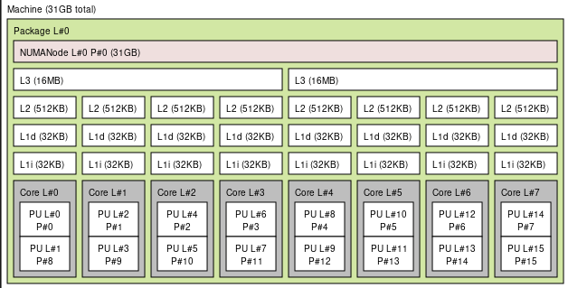

# A linux gaming guide

This is some kind of guide/compilation of things, that I got to do/learn about while on my journey of gaming on linux. I am putting it here so it can be useful to others! If you want to see something added here, or to correct something where I am wrong, you are welcome to open an issue or a PR !

## Table of Content

Click the "menu" button ↗️


## Linux distribution

I have seen many reddit posts asking which linux distributions is "best" for gaming. My thoughts on the matter is that, to get the best performance, one simply needs the latest updates. All linux distributions provide the sames packages and provide updates. Some provide them faster than others. So any distribution that updates its packages the soonest after upstream (aka the original developers), is good in my opinion. Some distributions can take longer, sometimes 6 months after, for big projects (which is acceptable too, since one would get the updates without the initial bugs).  

If you have a GPU from a latest generation, you should use the newest kernel.  
That's one of the reasons for me to suggest [Arch](https://archlinux.org/) with `archinstall` to make the installation very easy.  

Now, [CachyOS](https://cachyos.org/) exists... So that's my recommendation. 

> CachyOS does compile packages with the x86-64-v3, x86-64-v4 and Zen4 instruction set and LTO to provide a higher performance. Core packages also get PGO or BOLT optimization.

and important for nvidia users:  
> CachyOS includes a custom hardware detection tool that automatically identifies and installs the necessary drivers and packages for your system. This eliminates the need for manual driver searching, saving you time and effort after installation.

You can also setup the important things on any(?) distro, like
* Install the [CachyOS kernel](https://wiki.cachyos.org/features/kernel/)
* Use [proton-cachyos](https://wiki.cachyos.org/configuration/gaming/) (and many more things)
* Use a different [scheduler](https://wiki.cachyos.org/configuration/sched-ext/)
* Add [CachyOS repos](https://wiki.cachyos.org/features/optimized_repos/#adding-our-repositories-to-an-existing-arch-linux-install) to Arch installs

## Self-compiling

... is not really necessary, but just in case:  
Compiling is the process of transforming human written code (like C/C++/Rust/... etc) to machine runnable programs (the `.exe` files on Windows, on Linux they usually have no extension :P). Compiling is actually done by a program, a compiler, on linux it's `gcc` or `clang`. There is not a unique way to translate/compile code to machine runnable programs, the compiler has lots of freedom on how to implement that, and we can influence them by telling them to try "harder" to optimize the machine code, by giving them the so called "flags": a set of command line options given to the compiler, an example is
```shell
gcc main.c -O2 -march=native -pipe
```
where `-O2`, `-march=native` and `-pipe` are compiler flags. There are many flags that compilers accept, the ones specific to optimization are given in [GCC's documentation](https://gcc.gnu.org/onlinedocs/gcc/Optimize-Options.html). A few important (meta)flags
- The `-Ox`, where `x=1,2,3`, is a generic flag that sets the generic level optimization, it activates many other flags that actually do something. Distros compile the packages they ship usually with `-O2`
- The `-march` flag is a flag that tells the compiler to use additional features that aren't available for all CPUs: newer CPU implement some "instruction sets" (aka additional features) that enable them to perform some tasks faster, like [SIMD instructions](https://en.wikipedia.org/wiki/SIMD). It makes some programs faster, like `ffmpeg` with video conversion. These instruction sets are not used by default in packages shipped by distros as they need to have them able to run on all machines, even those from 2001. So one can win some performance by just compiling with `-march=native` their computational heavy programs. Although some have embedded detection code to use additional instruction sets if detected. Some Linux Distributions like [Gentoo](https://www.gentoo.org/) enable you to compile every single package on your own machine so you can have ALL the apps built with `-march=native` (it may take several hours depending on your CPU)
- Link Time Optimizations (LTO) that involve the use of the flags `-flto`, `-fdevirtualize-at-ltrans` and `-flto-partition`
- Profile Guided Optimizations (PGO) that involve the use of `-fprofile-generate=/path/to/stats/folder`, `-fprofile-use=/path/to/stats/folder` flags. The idea behind is to produce a first version of the program, with performance counters added in with the `-fprofile-generate=/path/to/stats/folder` flag. Then you use the compiled program in your real life use-cases (it will be way slower than usual), the program meanwhile fills up some extra files with useful statistics in `/path/to/stats/folder`. Then you compile again your program with the `-fprofile-use=/path/to/stats/folder` flag with the folder `/path/to/stats/folder` filed with statistics files that have the `.gcda` extension.

A nice introduction to compiler optimizations `-Ox`, `LTO` and `PGO`, is made in a Suse Documentation that you can find here: https://documentation.suse.com/sbp/all/html/SBP-GCC-10/index.html

The Kernel, `Wine`, `RADV` and `DXVK` can be compiled on your own machine so you can use additional compile flags (up to a certain level) for the particular CPU you own and potentially faster with more "aggressive" compiler flags. I said potentially as you need to check for yourself if it is truly the case or not.

### Flags to try

Here is a group of flags can use when building your own programs
```shell
BASE="-march=native -O3 -pipe"
GRAPHITE="-fgraphite-identity -floop-strip-mine"
MISC="-floop-nest-optimize -fno-semantic-interposition -fipa-pta"
LTO3="-flto -fdevirtualize-at-ltrans -flto-partition=one"
LTO2="-flto -fdevirtualize-at-ltrans -flto-partition=balanced"
LTO1="-flto -fdevirtualize-at-ltrans -flto-partition=1to1"
```
It is recommended to try them in the following order, if one fails (for whatever reasons: fails to compile or doesn't work), try the next one:
1. `BASE + GRAPHITE + MISC + LTO3`:
  ```
  -march=native -O3 -pipe -fgraphite-identity -floop-strip-mine -floop-nest-optimize -fno-semantic-interposition -fipa-pta -flto -fdevirtualize-at-ltrans -flto-partition=one
  ```
2. `BASE + GRAPHITE + MISC + LTO2`:
  ```
  -march=native -O3 -pipe -fgraphite-identity -floop-strip-mine -floop-nest-optimize -fno-semantic-interposition -fipa-pta -flto -fdevirtualize-at-ltrans -flto-partition=balanced
  ```
3. `BASE + GRAPHITE + MISC + LTO1`:
  ```
  -march=native -O3 -pipe -fgraphite-identity -floop-strip-mine -floop-nest-optimize -fno-semantic-interposition -fipa-pta -flto -fdevirtualize-at-ltrans -flto-partition=1to1
  ```
4. `BASE + GRAPHITE + MISC`
  ```
  -march=native -O3 -pipe -fgraphite-identity -floop-strip-mine -floop-nest-optimize -fno-semantic-interposition -fipa-pta
  ```
5. `BASE + GRAPHITE`
  ```
  -march=native -O3 -pipe -fgraphite-identity -floop-strip-mine
  ```
6. `BASE`
  ```
  -march=native -O3 -pipe
  ```


## DXVK

This is the library that maps DirectX 8-11 (Windows) to Vulkan (Multi-platform and open source) so games that are meant for Windows work on Linux. It's better than wine's built-in mapper called WineD3D.  
This is built in Proton and you don't need to install it!  

You can compile your own latest one with some "better" compiler optimizations (`proton-cachyos` is shipped that way) if you wish, and that's what I am doing but I have no idea about the possible FPS benefits of doing that. To do so you will need to put what DXVK's compile script gives you in `~/.local/share/lutris/runtime/dxvk/`. Link here: https://github.com/doitsujin/dxvk

```shell
git clone https://github.com/doitsujin/dxvk.git
cd dxvk
# Build new DLLS
./package-release.sh master ~/.local/share/lutris/runtime/dxvk/ --no-package
```

### Custom compile flags

DXVK can be compiled with [user provided compile flags](#self-compiling). For that, you edit `build-win32.txt` and `build-win64.txt` and change the following before running the `./package-release.sh` script:
```shell
[built-in options]
c_args=[... TO BE FILLED ...]
cpp_args=[... TO BE FILLED ...]
c_link_args = ['-static', '-static-libgcc', ... TO BE FILLED ...]
cpp_link_args = ['-static', '-static-libgcc', '-static-libstdc++', ... TO BE FILLED ...]
```
Where you can replace `... TO BE FILLED ...` with `BASE + GRAPHITE + MISC + LTO3` flags [defined here](#flags-to-try) if you don't enable `PGO`. If you want to use [PGO](#self-compiling), you can use the `BASE + GRAPHITE + MISC + LTO2` + `-fprofile-generate=/path/to/dxvk-pgo-data` or `-fprofile-use=/path/to/dxvk-pgo-data`, depending on the stage you are in. You can change the `=/path/to/dxvk-pgo-data` path. You also need to add `'-lgcov'` to `c_link_args` and `cpp_link_args`

**Note:** you need to respect the syntax of the `build-winXX.txt` files. Flags are quoted and separated with comas _e.g._ `c_args=['-O2', '-march=native']`.

These flag changes may improve performance or not, the best is to test with and without and see for oneself. If regressions happen or it doesn't want to compile you can try [other flags](#flags-to-try).

## VKD3D

Since DXVK only works for DirectX 8-11, [VKD3D](https://github.com/HansKristian-Work/vkd3d-proton) is for DirectX 12. Also included in all Proton versions.

## GPU

1. Update to the latest possible driver for your GPU
2. If you are hesitating between AMD and Nvidia for your next GPU buy. As far as Linux is concerned: AMD all the way, because they are way more supported since they give out an open source driver.

### Nvidia

The least one can do is redirect to Arch's documentation about it: https://wiki.archlinux.org/index.php/NVIDIA

If you didn't install the proprietary driver your computer is likely to be running an open source driver called `nouveau`, but you wouldn't want that to play games with that as it works based off reverse engineering and doesn't offer much performance.

Once you have the proprietary driver installed, open `nvidia-settings`, make sure you have set your main monitor to its maximum refresh rate and have 'Force Full Composition Pipeline' disabled (advanced settings).

Also, in Lutris, you can disable the size limit of the NVidia shader cache by adding `__GL_SHADER_DISK_CACHE_SKIP_CLEANUP=1` to the environnement variables.

### AMD
A nice documentation is given by, once again, Arch's documentation: https://wiki.archlinux.org/index.php/AMDGPU

* "Very old" GPUs: the opensource driver is `radeon` and you only have that as an option, along with AMD's closed source driver I believe. But you are out of luck for running DXVK, since both driver's don't implement Vulkan.
* "Old" GPUs: GCN1 and GCN2 are now supported by the newer "amdgpu" driver and you switch to it to win a few frames.
* New GPUs: the base driver is `amdgpu`, and is shipped and updated with the linux Kernel. Stacks on top of it three different drivers:
  * Mesa: the open source graphics stack that handles AMD, Intel, Qualcomm ...etc GPUs. The AMD OpenGL driver is called RadeonSI Gallium3D and is the best you can get. The Vulkan driver is called RADV
  * amdvlk: [Discontinued](https://www.gamingonlinux.com/2025/09/amdvlk-has-been-discontinued-as-amd-are-throwing-their-full-support-behind-radv/)
  * amdgpu PRO: AMD's official closed source driver, that has its own Vulkan and OpenGL implementation.

#### RADV

> [RADV](https://docs.mesa3d.org/drivers/radv.html) is a userspace driver that implements the Vulkan API on most modern AMD GPUs.

##### Self-compile

You can compile only RADV by hand with the extra bonus of using your own compiler optimizations [as described in this section](#self-compiling) and use it for any Vulkan game, in a per game basis.

First, you get the source code
```shell
git clone --depth=1 https://gitlab.freedesktop.org/mesa/mesa.git
```
This command will create a `mesa` folder. To compile only RADV, you go into the sources folder and do the following
```shell
cd path/to/mesa
git clean -fdx
mkdir build && cd build
export CFLAGS="... [To be Filled] ..."
export CXXFLAGS="${CFLAGS}"
export LDFLAGS="-Wl,-O1,--sort-common,--as-needed,-z,now ${CFLAGS}"
meson .. \
    -D prefix="$HOME/radv-master" \
    --libdir="$HOME/radv-master/lib" \
    -D b_ndebug=true \
    -D b_lto=TO BE CHANGED \
    -D b_pgo=TO BE CHANGED \
    -D buildtype=release \
    -D platforms=x11,wayland \
    -D dri-drivers= \
    -D gallium-drivers= \
    -D vulkan-drivers=amd \
    -D gles1=disabled \
    -D gles2=disabled \
    -D opengl=false
meson configure
ninja install
```
Where you need to fill a a few lines
- `CFLAGS` with flags, you can use `BASE + GRAPHITE + MISC + LTO3` from the [flags to try section](#flags-to-try).
- If you enabled the `LTO` flags you must set `-D b_lto=true`, otherwise `-D b_lto=false`
- With regards to PGO, first read [the bullet point about PGO](#self-compiling)
  1. Profile generation
      - you must set `-D b_pgo=generate`
      - append `-fprofile-generate=$HOME/radv-pgo-data` to `CFLAGS`, where you can replace `$HOME/radv-pgo-data` by another folder if you wish
  2. Profile use
      - you must set `-D b_pgo=use`
      - append `-fprofile-use=$HOME/radv-pgo-data` to `CFLAGS`, where you replace `$HOME/radv-pgo-data` with the same folder you used for profile generation
  3. No PGO, you must set `-D b_pgo=off`

These may improve performance or not, the best is to test with and without and see for oneself. If regressions happen, follow the steps in [flags to try section](#flags-to-try) to reduce the number of flags.

After running the lines above, you get the driver installed in `$HOME/radv-master`, you can change the folder name and where it is in the line `-D prefix="$HOME/radv-master"`. Now, to use it for Overwatch (or any other game), you must set the following environment variable (in Lutris, it's in "Configure" > "System Options" > Environment variables, and add it):
```shell
VK_ICD_FILENAMES=$HOME/radv-master/share/vulkan/icd.d/radeon_icd.x86_64.json:$OTHER_PATH/radeon_icd.i686.json
```
where you should manually replace `$HOME` by your home path `/home/Joe` and `$OTHER_PATH` by where `radeon_icd.i686.json` actually is, you can find out with
```
sudo updatedb
locate radeon_icd.i686.json
```
If the games crashes after doing all this, you can either try other git commits (you will need some git knowledge) or revert to the stable driver by simply removing the `VK_ICD_FILENAMES` environment variable. And if you don't wanna hear about bleeding edge mesa anymore you can simply remove the `mesa` source folder along with `$HOME/radv-master`.

## Kernel

First, try to get the latest kernel your distro ships, it often comes with performance improvements (it contains the base updates for the amd gpu driver for example).

### CPU mitigations

As you may know, the kernel has various protection mechanisms from malicious program-execution based attacks, the likes of [Spectre and Meltdown](https://en.wikipedia.org/wiki/Meltdown_(security_vulnerability)). These protections/mitigations come with [an extra overhead on the CPU](https://www.phoronix.com/scan.php?page=article&item=3-years-specmelt&num=9). (Un)fortunately, it is possible to disable ALL these mitigations, at the expense of security. Although if you use X11 then you are just adding an extra cherry on top of how unsecure your setup is haha. Since any running application can catch your keyboard and what's displayed on your monitor.

Okay, how to disable all mitigations ? Fortunately it's super simple: add `mitigations=off` command line to your [kernel parameters](https://wiki.archlinux.org/index.php/Kernel_parameters).  
**I have all mitigations enabled. Might only be required on low-end or old CPUs!**

I ran across another protection that got added in the kernel that disables a certain set of cpu instructions from user space programs (`umip`), instructions from this set is used for example in Overwatch some other games. That protection broke those games then the kernel got [a patch that emulates those instructions](https://github.com/torvalds/linux/commit/1e5db223696afa55e6a038fac638f759e1fdcc01) with a certain overhead with a kernel message like this one:
```shell
kernel: umip: Overwatch.exe[5970] ip:140621a9a sp:21dea0: For now, expensive software emulation returns the result.
```
You can disable this protection with the following kernel parameter `clearcpuid=514`

### Threading synchronization

you may have heard about `esync`, `fsync` or `futex2` threading synchronisation kernel syscalls. They have been developed by CodeWeavers and Collabora.  
Generally, you want to use `fsync`. `ntsync` is mostly [not faster](https://discuss.cachyos.org/t/proton-cachyos-ntsync-and-fsync-comparison-update/7932/11). `fsync` doesn't need to be explicitly installed, it's in Proton.  

Chronologically, here's what happened
- `esync` is the oldest implementation and available in any non ancient kernel in any distro, since it uses the kernel's `eventfd` [system call](https://man7.org/linux/man-pages/man2/eventfd.2.html). Issues arise in some distros when a game opens a lot of the so called "file descriptors"
- `FUTEX_WAIT_MULTIPLE`, a special additional flag on the `futex` [system call](https://man7.org/linux/man-pages/man2/futex.2.html) was developed. It was referred to in wine as `fsync` (that we will also call `fsync1`). This work did not get upstreamed in the linux kernel (out-of-tree).
- `futex_waitv` implementing  a new system call
  - Initially called `futex_wait()`: `linux-tkg` and `wine-tkg` were offering support for this work under the `futex2` naming.
  - The system call then [got upstreamed](https://www.kernel.org/doc/html/latest/userspace-api/futex2.html) in kernel `5.16` with a slightly different name : `futex_waitv()` for the system call, and `futex2` as a feature. It is still referred to as `fsync` in wine (so basically an `fsync2`). Which leads to some confusions...

`ntsync` (also previously called `winesync`) is a new proposal of synchronization subsystem, similar to `futex` and `eventfd`, aimed to serve exclusively for mapping Windows API sync mechanisms. developed by wine developers. This implementation is kind of on hold since the upstreaming of `futex_waitv`. `ntsync` is a kernel module that communicates with the `ntsync` counterpart (also previously called `fastsync`) in (a patched) wine. To have the `ntsync`:
- The DKMS route
  - Archlinux: you need to install the following package from the AUR: `ntsync`
- Use [linux-tkg](#compiling-your-own-linux-tkg) with `_ntsync="true"` in its customization file.
### Custom kernels

Using a self-compiled kernel can bring some gaming improvements. Ready to use pre-build custom kernels are readily available: Xanmod kernel, Liquorix, Linux-zen.

#### Compiling your own: linux-tkg

For self-compiling a kernel, there is a git repository called [linux-tkg](https://github.com/Frogging-Family/linux-tkg) that provides a script to compile the linux Kernel from source (takes about ~30mins, but can be stripped down with `modprobed-db`) with some customization options e.g. changing/tweaking the default [scheduler](https://en.wikipedia.org/wiki/Scheduling_(computing)) ([EEVDF](https://en.wikipedia.org/wiki/Earliest_eligible_virtual_deadline_first_scheduling) is the default) ; along with other patches that help getting better performance in games. You can also provide your own patches if you want, giving this tool a lot of flexibilty. `linux-tkg` needs to be compiled on your own machine, where you can use compiler optimizations such as `-O3` and `-march=native` (which is really an `mtune=native` than anything else, SIMD instructions are explicitly disabled by design), LTO can be used with Clang (PGO may come ?), with an interactive script and a config file, I worked on the script that installs `linux-tkg` on non-Arch distros.

### Game mode

It's a small program that puts your computer in performance mode: as far as I know it puts the frequency scaling algorithm to `performance` and changes the scheduling priority of the game. It's available in most distro's repositories and I believe it helps in giving consistent FPS. Lutris uses it automatically if it's detected, otherwise you need to go, for any game in Lutris, to "Configure" > "System Options" > "Environment variables" and add `LD_PRELOAD="$GAMEMODE_PATH/libgamemodeauto.so.0"` where you should replace `$GAMEMODE_PATH` with the actual path (you can do a `locate libgamemodeauto.so.0` on your terminal to find it). Link here: https://github.com/FeralInteractive/gamemode.

You can check whether or not gamemode is running with the command `gamemoded -s`. For GNOME users, there's a status indicator shell extension that show a notification and a tray icon when gamemode is running: https://extensions.gnome.org/extension/1852/gamemode/


### AMD Ryzen: the `cpuset` trick

#### A small intro to CPU cache
The cache is the closest memory to the CPU, and data from RAM needs to go through the cache first before being processed by the CPU. The CPU doesn't read from RAM directly. This cache memory is very small (at maximum few hundred megabytes as of current CPUs) and this leads to some wait time in the CPU: when some data needs to be processed but isn't already in cache (a "cache miss"), it needs to be loaded from RAM. When the cache is "full", because it will always be, some "old" data in cache is synced back in RAM then replaced by some other data from RAM: this takes time.

There is usually 3 levels of cache memory in our CPUs: L1, L2, and L3. The L1 and L2 are few hundred kilobytes and the L3 a (few) dozen megabytes. Each core has usually its own L1 and L2 cache, the L3 is shared with other cores.

Ryzen CPUs are made of "chiplets": physical "islands" (some kind of sub-CPUs) of 8 cores with identical specs. A CPU can have several "chiplets".

[This anandtech article](https://www.anandtech.com/show/16214/amd-zen-3-ryzen-deep-dive-review-5950x-5900x-5800x-and-5700x-tested/4) gives a thorough analysis of cache topology in `Zen 2` and `Zen 3`, which apply so far till Zen4 :
- `zen`/`zen+`/`zen2`: the chiplets are split into two regions of 4 cores with separate 16MB L3 cache.
- `zen3`/`zen4`: the chiplet is one single entity with 32MB of shared L3 There's


One can obtain the cache topology if his current machine by running the following command:
```shell
$ lstopo
```

The lstopo of my previous Ryzen 3700X gives this



For my Ryzen 5950X gives this


#### `cpuset`
Now that we are aware of cache topology in AMD CPUs. We can try giving an entire CCX (for Zen/Zen+/Zen2 for CPUs that have `>=6` cores) or CCD (for Zen3/Zen4, for CPUs that have `>=12` cores) to your game, and make (nearly) everything else run in the other CCX(s)/CCD(s). With this, as far as I can hypothesize, one reduces the amount of L3 cache misses for the game, since it doesn not share it with other processes.

[cpuset](https://www.kernel.org/doc/html/latest/admin-guide/cgroup-v1/cpusets.html) is a linux mechanism to create groups of cores (a cpu set) to which you can assign processes, at runtime. Any process in a given cpu set will spawn child processes in the same cpu set. Have a read at the doc to understand how things work.

Two scripts are provided in this repo:
- [tasks_redirect_generic.sh](./scripts/tasks_redirect_generic.sh). This script needs to be run with `lutris` openned by before launching a game.
  1. Creates two cpusets `theGood` and `theUgly`.
  2. Redirects every process to `theUgly`
  3. Prompts to redirect `lutris` to the `theGood` cpuset, so anything launched through `lutris` starts in the same cpuset automatically.
- [reverse_tasks_redirect.sh](./scripts/reverse_tasks_redirect.sh): reverses the splitting done by the script above.
  - Info: created cpu sets (that are folders) can be removed if all the processes they contain get redirected to the main cpu set, that contains all cores.

##### Checking that it works

Core IDs should be carefully chosen so the cpu sets are separated by CCX/CCD and not just make a non hardware aware split. One way to check it is, after doing the splitting, to call `lstopo` in both cpusets and have a look at its output. A way to do so is to move one shell to the new group, as root:

```shell
/bin/echo $$ >> /dev/cpuset/theGood/tasks
lstopo
```


Then also open another shell, and do `lstopo`, you should get separate results:


#### Benchmark
I did [this benchmark](#overwatch-cpuset) on Overwatch, the conclusions are the following:
- After a fresh restart, I already have a small number of processes (around 300), and most of them are sleeping, which means that Overwatch basically already has the entirety of the CPU for itself. Doing the cpuset trick reduced the performance: I think it's because Overwatch works optimally in more than 4 cores.
- Playing while doing another heavy workload, like stream with software encoding, works better with the cpuset trick.
## Wine

Wine is a program that enables running windows executables on Linux. Through Wine, windows executables run natively on your linux machine (**W**ine **I**s **N**ot an **E**mulator xD), Wine will be there to remap all Windows specific behavior of the program to something Linux can handle, `DXVK` for example replaces the part of Wine that maps `DirectX` (Windows specific) calls of executables to Vulkan calls (That Linux can handle). Tweaking Wine can have quite the impact on games, both positive and negative.

#### Environment variables

Some [wine environment variables](https://wiki.winehq.org/Wine-Staging_Environment_Variables#Shared_Memory) can be set that can help with performance, given that they can break games, they can be added on a per-game basis as usual in Lutris. The variables are the following:

```shell
STAGING_SHARED_MEMORY=1
STAGING_WRITECOPY=1
```
### Threading synchronisation

To leverage the kernel's threading synchronisation primitives (see [Kernel: threading synchronization](#threading-synchronization)) in windows apps/gaes, wine has to be the middle-man in between.
#### Esync-Fsync
To be able to handle `fsync/futex2`, you will need a patched version of wine. To enable it, you need to set the following environment variable
```shell
WINEFSYNC=1
WINEESYNC=1
```
Where `WINEESYNC=1` is here as a fallback if ever `fsync` doesn't work.

To know wether `esync` or `fsync` are running. You can try running your game/launcher from the command line and you should see one of the following in the logs:
- `esync`:
  ```shell
  [...]
  esync: up and running
  [...]
  ```
- `fsync`:
  ```shell
  [...]
  fsync: up and running
  [...]
  ```

#### Fastsync

To be able to use `fastsync`, you need the following, **in this order**
1. Be running a `winesync` enabled kernel, more information [in this section](#threading-synchronization)
2. Have a custom wine built with `winesync` support (e.g. `wine-tkg` offers it). This may mean `fsync` support needs to be disabled.
3. Disable all environment variables related to `esync/fsync` (and also from lutris' game options):
    ```shell
    WINEESYNC=0
    WINEFSYNC=0
    ```
To know if fastsync is correctly working, you may run your game/launcher from the command line once and look for the following lines:
```shell
wineserver: using server-side synchronization.
wine: using fast synchronization.
```
This command should also return few executables
```shell
lsof /dev/winesync
```
**Note:** even with this, sometimes `fastsync` did not correctly work for me... `fastsync` should have a similar performance to `fsync/futex2` so far, so if it doesn't work for you, switch back to `fsync/futex2` then try again a little bit later.

### Wine-tkg
[wine-tkg](https://github.com/Frogging-Family/wine-tkg-git) is a set of scripts that clone and compile `wine`'s source code, on your own machine, with extra patches that offer better performance and better game compatibility. One of the interesting offered extra features are additional [threading synchronization](#threading-synchronization) primitives that work with the corresponding patched `linux-tkg` kernel. One can use `Esync+Fsync+Futex2` or `fastsync` (with its corresponding kernel module `winesync`).

#### compiler optimizations

On top of the config variables that can be toggled in `customization.cfg` in `wine-tkg`, you can set [custom compiler optimizations](#self-compiling) by editing the following lines of the file `wine-tkg-profiles/advanced-customization.cfg`

```shell
_GCC_FLAGS="... EDIT HERE ..."
# Custom LD flags to use instead of system-wide makepkg flags set in /etc/makepkg.conf. Default is "-pipe -O2 -ftree-vectorize".
_LD_FLAGS="-Wl,-O1,--sort-common,--as-needed"
# Same as _GCC_FLAGS but for cross-compiled binaries.
_CROSS_FLAGS="... EDIT HERE ..."
# Same as _LD_FLAGS but for cross-compiled binaries.
_CROSS_LD_FLAGS="-Wl,-O1,--sort-common,--as-needed"
```
Where you can change `... EDIT HERE ...` with flags [from here](#flags-to-try): note that LTO nor PGO works with wine, you can at most use the `BASE + GRAPHITE + MISC` flags

## Game / "Wine prefix" manager

To run games on Linux, wine creates a so-called "prefix" folder with an arbitrary user chosen name, let's say `game-prefix`. It contains all the configuration specific to wine and a folder structure, within the `drive_c` subfolder, that follows Windows' structure: you can find e.g. `Program Files` or `windows/system32` subfolders in it. The DLLs in the latter folder are actually created by wine, through reverse engineering. From a game's/window's app perspective, these DLLs to behave just like windows, and wine takes care of the rest (by implementing system calls itself, in the wineserver I believe, or redirecting to the linux kernel, correct me if I am wrong please).

Usually, one creates one prefix per game/app, as sometimes each game has some quirks that  wine doesn't handle well by default for which a tweak is needed. But that tweaks would break other games apps. And that's where a "game manager" / "wine prefix manager" comes into play to avoid tedious and repetitive manual configurations:
- Automatically creates prefixes for each of your game
- Ships various version of Wine to work with the various versions of your games
- Bundles various DXVK versions to chose from
- Offers various options that can be toggled (`fsync`, `dxvk-nvapi/dlss`, `fsr`, `latencyflex`...)
- May have built-in support for extra tools like FPS counters (see [Performance overlays](#performance-overlays)), or other kinds of stuff (see e.g. [Game render tweaks: vkBasalt](#game-render-tweaks-vkbasalt))


### Lutris
[Lutris](https://lutris.net/) is one of these Generic open source game managers, it offers a [database](https://lutris.net/games) of scripts to automatically install various games and the quirks and/or extra configuration (e.g. extra fonts) needed to run them. It also enables you to give it your own compiled wine version and that's why I am using it currently. It is however lagging a bit behind in integrating the new tools that are being developped (e.g. `latencyflex`) and offering newer versions of runtime components (`Wine`, `dxvk`, ...). To see the toggles Lutris offers, install a game, then click `Configure` > `Runner options` tab.

### Bottles
[Bottles](https://usebottles.com/) is a modern take on generic open source game managers, it has a more intuitive configuration UI, ships the latest builds of `wine`/`dxvk`, and tries to implement integration with all the latest other tools. I could however not find how to make it use my own compiled wine version.

### Heroic Games Launcher
[Heroic Games Launcher](https://heroicgameslauncher.com) is an opensource game manager for games you own on [GOG](gog.com) or [Epic Games](https://store.epicgames.com). I have not tried it at all so that's all I can say x)

### Steam
Valve's official closed source game manager handles Linux natively and offers to run windows specific games with Steam's own builds of `proton-wine`. It also accepts custom proton builds like e.g. `proton-tkg` ([wine-tkg](https://github.com/Frogging-Family/wine-tkg-git) repo) or GloriousEggroll's [proton-ge-custom](https://github.com/GloriousEggroll/proton-ge-custom) prebuilds.

#### SteamTinkerLaunch

From [its Github page]((SteamTinkerLaunch))
> [Steam Tinker Launch](SteamTinkerLaunch) is a versatile Linux wrapper tool for use with the Steam client which allows for easy graphical configuration of game tools, such as GameScope, MangoHud, modding tools and a bunch more. It supports both games using Proton and native Linux games, and works on both X11 and Wayland.

#### Knowledge Base

##### Troubleshooting: first thing to try

When your game simply doesn't work or worked once and then never again, try removing the [Wine Prefix](#game--wine-prefix-manager) created by steam for the game: remove the folder `SteamLibrary/steamapps/compdata/$GAMEID/pfx` (where `$GAMEID` is some unique ID that identifies the game, e.g. `1151640` for `Horizon Zero Dawn`). Then try relaunching the game.

##### Troubleshooting: getting logs

To first step to any troubeshooting is to get logs, in Steam, you need to set a specific launch option
```
PROTON_LOG=1 %command%
```
which you can reach by doing this (taken from [here](https://help.steampowered.com/en/faqs/view/7D01-D2DD-D75E-2955)):
1. Open your Steam Library
2. Right click the game's title and select `Properties`.
3. On the `General` tab you'll find `Launch Options`` section.
4. Enter the launch options `PROTON_LOG=1 %command%`
5. Close the game's `Properties` window and launch the game.
6. Recreate your issue
7. A file name `steam-$GAMEID.log` (where `$GAMEID` is some unique ID that identifies the game, like `1151640` for `Horizon Zero Dawn`) will be in your home folder (`/home/foo`)

In the log file (`steam-$GAMEID.log`), look for `err:` lines first, and use the keywords that appear there to know what to google for. Otherwise give the log entirely to people who may ask for it.

##### Shared NTFS partition with Windows

If you simply used a shared NTFS partition with windows and making Steam (Linux) discover it without further tweaks, you most probably will run into problems.

Like this one with `IPHLPAPI.DLL` (which I ran into)
```
24337.090:0124:0128:err:module:import_dll Library IPHLPAPI.DLL (which is needed by L"E:\\SteamLibrary\\steamapps\\common\\Horizon Zero Dawn\\HorizonZeroDawn.exe") not found
```

The fix is to [delete the prefix](#troubleshooting-first-thing-to-try) then to follow [Proton's documentation on the matter](https://github.com/ValveSoftware/Proton/wiki/Using-a-NTFS-disk-with-Linux-and-Windows) which involves having the path `/SteamLibrary/steamapps/compatdata` symlink to a folder outside of the NTFS partition, to a folder within a Linux filesystem (Btrfs, EXT4, ...etc ).

**Note:**
- To avoid having problems when using an NTFS partition on Linux, use `ntfs3` as a filesystem type in your [/etc/fstab](https://wiki.archlinux.org/title/Fstab) file to use [ntfs3 kernel driver](https://wiki.archlinux.org/title/NTFS) (instead of `ntfs` which uses [ntfs-3g userspace driver](https://en.wikipedia.org/wiki/NTFS-3G)) with the mount option `windows_names` ([described here](https://www.kernel.org/doc/html/latest/filesystems/ntfs3.html)). With that, creating the prefix `/SteamLibrary/steamapps/compatdata` within the NTFS partition will fail.
- If you get an `rm: traversal failed` when trying to delete the prefix (or something else within the NTFS partition). That means your NTFS partition got corrupted and you will need to use Windows to scan and fix errors in the filesystem. Unfortunately Linux has no tool to fix NTFS filesystems.

## Overclocking

### CPU and GPU
Overclocking is possible on Linux, please refer to the Archlinux wiki on [Improving performance](https://wiki.archlinux.org/index.php/Improving_performance#Overclocking) for more information.

### RAM

I have found a super nice [guide on Github](https://github.com/integralfx/MemTestHelper/blob/oc-guide/DDR4%20OC%20Guide.md) on the matter.
## Input lag / latency: benchmark at home
I have always had a wired gaming mouse, and always had sometimes this issue where the cable gets entangled when I am playing my FPS game. So I started looking into wirless ones, and this got me interested in mouse latencies: do wireless mice have higher input lag ? This question generalizes to mice and keyboards in general, and also to games.

For that, one can test, by himself, his own mouse or keyboard (or game), provided that one has a high refresh rate monitor and a smartphone with a high refresh rate camera. Thankfully enough, I have a 270Hz monitor and a smartphone that offers 960fps slow-mo videos: This gives me a latency "resolution" $`\Delta t_\text{res} = T_\text{mon} = 1000/270 \approx 3.7 \text{ms}`$ and a latency "precision" $`\Delta t_\text{prec} = T_\text{cam} = 1000/960 \approx 1\text{ms}`$, plenty to get accurate enough latencies !

Here's how I proced to test latencies:
1- have your smartphone ready to take a slow-mo video, while having both the mouse/keyboard area and monitor visible within the frame
2- start the slow-mo
3- hit the keyboard/mouse key or hit the mouse with your finger, hit it fast so the inaccuracy of when the mouse starts to move, click records is the smallest.
4- Analyze the video:
   - The origin of the time $`t_\text{i}`$ ("physical input start") is taken at the first camera frame where we can consider that the input has started, and we write $`\delta t_i`$ the uncertainty on it, because the actual frame where the click/move signal is registered by the device is hard to determine.
     - For a click:
       - $`t_\text{i}`$: the frame right before the frame where the button starts getting pushed
       - $`\delta t_i`$: the number of frames between $`t_\text{i}`$ and the first frame where the button does not get pushed any lower
     - For mouse movement:
       - $`t_\text{i}`$: the frame right before the mouse body gets deformed from the hit
       - $`\delta t_i`$: the number of frames between $`t_\text{i}`$ and when the entire mouse body moves
   - Identify the the time of the first camera frame $`t_\text{cf}`$ ("output event camera frame") where something happens on-screen, in reaction to the input: mouse cursor moves, letter appears, game view moves ...etc.
     - Note that $`t_\text{cf}`$ is at most $`\Delta t_\text{res}`$ away from the last screen refresh $`t_\text{mf}`$ ("output event monitor frame") where the image got updated, equivalently:
       - $`t_\text{cf} - \Delta t_\text{res} \le t_\text{mf} \le  t_\text{cf}`$
       - The high speed camera introduces an uncertainty of $`\Delta t_\text{res}`$
     - The time $`t_\text{mf}`$ of the last monitor frame refresh reflects what information has been given to the PC in the $`\Delta t_\text{res}`$ timeframe that preceded, so we need to take that into account in our computation of the lower bound of the latency

Now we have enough information to define an approximate upper-bound and lower-bound estimation of the device's latency (click latency / delay of start-of-movement):
- Upper bound $`\mu_\text{max} = t_\text{cf} - t_\text{i} `$
- Lower bound $`\mu_\text{min} = \mu_\text{max} - \Delta t_\text{prec} - \Delta t_\text{res} - \delta t_\text{i} `$


An important note:
- If you are testing the device itself, do NOT test on a game: a game adds input lag on top of the one the keyboard/mouse has. I found out that testing on the mouse cursor on the desktop is way better ! Preferably with the compositor disabled.

Once you have an estimation of the latency of your device, you can start benchmarking game related input lag!

An interesting note:
The website https://rtings.com has some high quality mouse/keyboard benchmarks where:
  - They measure latencies [directly from the USB signal](https://www.rtings.com/mouse/tests/control/sensor-latency) leaving the mouse without even using a monitor.
  - They [subtract the pre-travel distance time](https://www.rtings.com/keyboard/tests/latency) when measuring a keyboard's latency

However, you may find it that the delay of start of movement you measure is lower than what they report (as I did with my Sensei Ten mouse), I contacted them and it seems that the difference lies in the fact that the benchmarking procedure I took pushes the mouse with a high acceleration, whereas they test with an electric motor that cannot start with a high acceleration.

Some benchmarks following this procedure are following in the [benchmarks/mice](#mice) section.

## X11/Wayland

Wayland is the successor to X11, and is now mature and supported enough for X11 to be phased out, and that's what most linux distros are starting to consider.

- Wayland
  - As of KDE 6 and Gnome 46, gaming on wayland just works without any downside (?).
    - Games however still use XWayland (a "small" X server within the Wayland session to play the game) by default
      - Proton (e.g. in Steam) doesn't support wayland at all for now, so it will use XWayland.
      - Starting wine 9.22, native wayland is supported by simply starting the game with the environment variable `DISPLAY` unset / empty. YMMV
  - VRR is supported out of the box can be toggled using the GUI settings app
  - HDR is supported

- X11, some recommendations:
  - The `TearFree` option,  to enable it on `AMDGPU`, [follow this](https://wiki.archlinux.org/title/AMDGPU#Tear_free_rendering).
    - It may be argued that it highers the input lag, I think that it's theoretically right and we want the lowest felt input lag.
      - However, with high refresh rate monitors (e.g. 240Hz), image update smoothness is noticeable vs the theoretically added input lag. Try and see !
      - This option entirely removes screen tearing with anything: for example scrolling on Firefox, on compositor-less DEs like LXDE, becomes super smooth.
  - If you have a FreeSync/Gsync monitor and a GPU that supports it, [follow this documentation](https://wiki.archlinux.org/title/Variable_refresh_rate) on how to enable it on Linux. Reviews of monitors seem to show that enabling this actually adds input lag, but once again, it's better than tearing.

## Performance overlays

Performance overlays are small "widgets" that stack on top of your game view and show performance statistics (framerate, temperatures, frame times, CPU/RAM usages... etc). Two possibilities:

* MangoHud: It is available in the repositories of most linux distros, to activate it, you only need to add the environment variable `MANGOHUD=1`, and the stats you want to see in `MANGOHUD_CONFIG`. The interesting part of MangoHud is that it can also bechmark games: Record the entirety of the frame times, calculate frametime percentiles...etc Ideal to do benchmarks with. More information here: https://github.com/flightlessmango/MangoHud. It can be configured via a GUI with GOverlay - https://github.com/benjamimgois/goverlay
* DXVK has its own HUD and can be enabled by setting the variable `DXVK_HUD`, the possible values are explained in [its repository](https://github.com/doitsujin/dxvk)

## Streaming - Saving replays

### OBS

[OBS](https://obsproject.com/) is the famous open source streaming software: it helps streaming and recording your games, desktop, audio input/output, webcams, IP cameras... etc.

**An important fix for an issue I have been having for a year now**
- __Network Error on Twitch:__ Switching between sources that leave a black screen for a very short time, _e.g._ having the game in a virtual desktop then switching to another virtual desktop, makes the stream on twitch crash for whatever reason. To work around this, keep a background image behind all of your sources, so whenever nothing is supposed to be shown, it's that background image instead of a black background.

#### DMA-BUF

The ["dma-buf" sharing protocol](https://elinux.org/images/a/a8/DMA_Buffer_Sharing-_An_Introduction.pdf) is the newest approach to screen/app/game capturing, better than Xcomposite window capturing method in OBS/X11 in terms of overhead and added input lag. This feature can only be used by `obs-studio` version `27.0` onwards.

To use this protocol for capturing windows/desktop, you need a fairly recent version of your favorite DE (Gnome >= 42, KDE >= ?) and be using pipewire + xdg-portal-kde/xdg-portal-gnome. You can also use it to capture games specifically using the [obs-vkcapture](#obs-vkcapture) plugin which is DE agnostic.

If your distro doesn't provide that version, it can be installed via `flatpak`
```shell
flatpak install --user https://flathub.org/beta-repo/appstream/com.obsproject.Studio.flatpakref
```
Under X11, you need to run OBS with an extra environment variable, `OBS_USE_EGL=1`:
```shell
OBS_USE_EGL=1 com.obsproject.Studio
```
where `com.obsproject.Studio` is the name of the `obs-studio` executable, installed through flatpak, it may have another name in your specific distro.

##### obs-vkcapture

[obs-vkcapture](https://github.com/nowrep/obs-vkcapture) implements the ["dma-buf" sharing protocol](https://elinux.org/images/a/a8/DMA_Buffer_Sharing-_An_Introduction.pdf) for capturing games: it needs the version `27.0` of `obs-studio`, or newer, to be installed in the regular way because it needs headers from it (it must be possible to use the flatpak version too but I don't know how). If your distro doesn't ship that version of `obs-studio`, you can compile from source ([documentation here](https://github.com/obsproject/obs-studio/wiki/Install-Instructions#linux-build-directions)).

Once you have a working `obs-studio` version `27.0` or higher, you need to compile `obs-vkcapture` form source then install it : documentation is in its [Github page](https://github.com/nowrep/obs-vkcapture) (it's also on the `AUR` on Arch, and in `GURU` on Gentoo). After that, you need to run `obs-studio` with the environment variable, `OBS_USE_EGL=1`:
```shell
OBS_USE_EGL=1 obs
```
And you will see a `game capture` as a new source entry. It works great and fixed my issues with added input lag and stuttering `obs-studio` used to have with `Xcomposite` sources. Games need to run with the environment variable `OBS_VKCAPTURE=1` or need to be run with the command `obs-vkcapture wine yourgame` (the command gets installed when installing `obs-vkcapture`).

#### Encoders

With AMD GPUs, one can use `ffmpeg-vaapi` to leverage the GPU for encoding, which is offered out of the box. `ffmpeg-amf` contains additions from AMD's [AMF](https://github.com/GPUOpen-LibrariesAndSDKs/AMF) library, but [it needs some work](https://www.reddit.com/r/linux_gaming/comments/qwqxwd/how_to_enable_amd_amf_encoding_in_obs/) : to install `amf-headers`, `ffmpeg` with `amf` enabled, `amdgpu-pro-vulkan` and `amdgpu-pro-amf` packages. Archlinux and Gentoo have that in place, I did the Gentoo work :D.

Nvidia has been reported to work nicely on linux and on windows with their new `nvenc` encoder.

To compare between encoders with your particular game, you can record a short lossless video `lossless.avi` (the one I made is  [this one](https://github.com/AdelKS/LinuxGamingGuide/raw/master/videos/lossless.avi)) using this option on `obs`


Then, you can transcode it, for example using `ffmpeg-vaapi` with the settings you want to use for streaming:

```shell
ffmpeg -i 'lossless.avi' -vcodec h264_vaapi -profile:v high -level 5.2 -vf 'format=nv12,hwupload' -vaapi_device '/dev/dri/renderD128' -b:v 4500000  'vaapi.mp4'
```

in this case `High@5.2` at `4500kbps` (I obtain  [this video](./video/vaapi.mkv)). We can do the same with `ffmpeg-amf` (after getting it properly installed)

```shell
VK_ICD_FILENAMES=/usr/share/vulkan/icd.d/amd_pro_icd64.json ffmpeg -i 'lossless.avi' -vcodec h264_amf -profile:v high -level 5.2 -quality quality -b:v 4500000  'amf.mp4'
```

which in this case is `High@5.2` at `4500kbps` (I obtain  [this video](./video/amf.mkv)). Then, we can compare between both by using [Netflix's VMAF](https://github.com/Netflix/vmaf/) scoring for each encoded file:

```shell
# mesa-23.1.5
➜ ffmpeg -i 'vaapi.mp4' -i 'lossless.avi' -filter_complex libvmaf -f null -

[... cropped output ...]

VMAF score: 77.785380

➜ ffmpeg -i 'amf.mp4' -i 'lossless.avi' -filter_complex libvmaf -f null -

[... cropped output ...]

VMAF score: 80.747651
```

This shows that `amf` gets better quality videos than `vaapi` on my `RDNA1` `RX 5700 XT` GPU. You can try for yourself using [the lossless video I used](./video/lossless.avi) and convert it with your encoder: I would love to know how much better nvidia's `nvenc` is, at the same `4.5mbps` bitrate; and also Intel's, issues/PRs welcome!

Notes:
- To know the details on how a video file `video.mkv` is encoded, you can use the `mediainfo` command (needs installing the related package): `mediainfo video.mp4`.
- To know the options offered by your encoder within `ffmpeg` you can write the following: `ffmpeg -h encoder=h264_amf`, where you replace `h264_amf` with the name of the encoder you want, that `ffmpeg` supports.
- The `'format=nv12,hwupload'` is due to `vaapi` not being able to handle the input color format and a translation is done on the CPU, and apparently this is done when using `ffmpeg-vaapi` for streaming on `obs`, when compared to `ffmpeg-amf`.
- The `VK_ICD_FILENAMES=/usr/share/vulkan/icd.d/amd_pro_icd64.json` at the beginning of the `AMF` transcoding overrides the vulkan driver with AMD's closed source one from their PRO series driver. The name `amd_pro_icd64.json` depends on the distro but the path should remain the same.


#### Using `cpuset` with software encoder on Ryzen CPUs

If you can't use your own GPU for encoding or prefer to use a software encoder, it's a very good idea to use the `cpuset` trick explained above to not affect your game's performance by running OBS in a different CCX/CCD. I benchmarked it and it makes a huge difference.

#### Replay Buffer

OBS offers saving the last X seconds of your gaming session in RAM, and it saves it to a file once you press a pre-defined keyboard shortcut.

To enable it:
1. Settings > Output > Replay Buffer > Enable Replay Buffer
   - You can also set there how long is the saved window
2. This adds a new button the the main window: "Start replay buffer"
   - It will keep in RAM the last X seconds all the time
3. While "replay buffer" is started and running, you can either
   - press the "save" button that is right next to "stop replay buffer"
   - trigger the keyboard shortcut for "save replay"

## Sound tweaks with Pipewire/Pulseaudio

This section is about some tweaks one can do with [Pulseaudio](https://www.freedesktop.org/wiki/Software/PulseAudio/) or [Pipewire](https://pipewire.org/) (will replace Pulseaudio and offers more features).
### Stream only the game sounds

You are in a Discord call and streaming at the same time, but you only want OBS to stream the game's sounds ? Search no more. The solution is here (that I found [here](https://unix.stackexchange.com/questions/384220/how-to-create-a-virtual-audio-output-and-route-it-in-ubuntu-based-distro)): the idea is to create some kind of virtual soundcard, let's call it `Game-Sink`, where the game will output it sound on. Then you redirect the sound from `Game-Sink` to your actual soundcard.

Create `Game-Sink`:
```shell
pactl load-module module-null-sink sink_name=game_sink sink_properties=device.description=Game-Sink
```
Find the actual name of `$OriginalSoundcard`: you do this command and look at its output, you should recognize your card's name there:
```shell
pactl list sinks | grep name:
```
For example, for me I have a SteelSeries Arctis PRO with the Game DAC (with cable), the name of my card is `alsa_output.usb-SteelSeries_SteelSeries_GameDAC_000000000000-00.iec958-stereo`. So here's how you do the loopback from `Game-Sink`:
```shell
pactl load-module module-loopback source="game_sink.monitor" sink="alsa_output.usb-SteelSeries_SteelSeries_GameDAC_000000000000-00.iec958-stereo" source_output_properties="stream.capture.sink=1"
```
Then, all what's left is to do is to open `pavucontrol` (google how to install it if you don't have it) and select `Game-Sink` for where `obs-studio` picks its audio from. And select `Game-Sink` for where the game outputs its audio to.

### Improve the sound of your headset

There is a nice Github repository, called [AutoEq](https://github.com/jaakkopasanen/AutoEq), that references the frequency responses of various headsets that have been reviewed by websites like [rtings.com](rtings.com) and others. The frequency responses are made available as `.wav` files in that repository.

A headset with high fidelity should have a flat frequency response, but affordable/real life headsets do not exhibit a flat one. What one can do with those `.wav` files is to use them and correct what is fed to the headset with software and improve the perceived sound. Although, one must know that the frequency response of one's own headset is for sure different from the ones available in [AutoEq](https://github.com/jaakkopasanen/AutoEq). But it may still improve one's audio experience if, let's say, all the headsets from your specific model have a similar frequency response.

#### The Graphical way

Install `easyeffects` (`pulseeffects-legacy-git` for `Pulseaudio` from the AUR if on Archlinux) and enable the "Convolver" plugin for your ouput sound:


You need to download the corresponding `.wav` file to your headset, from the [AutoEq](https://github.com/jaakkopasanen/AutoEq) github repository. For example the files related to my headset are [these ones](https://github.com/jaakkopasanen/AutoEq/tree/master/results/rtings/rtings_harman_over-ear_2018/SteelSeries%20Arctis%20Pro%20GameDAC). There's a 44.1kHz and a 48kHz version for those `.wav` files. Pick the highest frequency your soundcard can handle, or just try both if you are too lazy to figure that out haha.

*Note:* the `easyeffects` app must remain open for this to keep on working, except if you enable the "start as a service on login" menu option then log out and back in.
### Mic noise suppression

You have cherry blue mechanical keyboard, your friends and teammates keep on complaining/sending death threats about you being too noisy with your keyboard ? Fear no more.

**A bit of history:** People from Mozilla made some research to apply neural networks to noise suppression from audio feeds, they [published](https://jmvalin.ca/demo/rnnoise/) everything about it, including the code. Another person, "Werman", picked up their work and made it work as a [PulseAudio plugin](https://github.com/werman/noise-suppression-for-voice).

#### The Graphical way

* If you are using Pipewire, install [easyeffects](https://github.com/wwmm/easyeffects), it probably is in your distro's repositories.
* If you are still on Pulseaudio, you can install a "legacy" version of `easyeffects`, called [pulseffects-legacy](https://github.com/wwmm/easyeffects/tree/pulseaudio-legacy). It may be available in your distro's repositories (e.g. `pulseeffects-legacy-git` from the AUR, on Archlinux) or you need to build it from source.

Enable the "Noise Reduction" plugin for your mic:


*Note:* the `easyeffects` app must remain open for this to keep on working, except if you enable the "start as a service on login" menu option then log out and back in.
#### The command line way

All this is explained in [Werman's Git repository](https://github.com/werman/noise-suppression-for-voice). I will put it back here. It works for both Pipewire and Pulseaudio

1- Clone, build and install the plugin
```shell
git clone https://github.com/werman/noise-suppression-for-voice.git noise-suppression
cd noise-suppression
cmake -Bbuild-x64 -H. -DCMAKE_BUILD_TYPE=Release
cd build-x64
make
sudo make install
```
2- At each login, one needs to do this: create a virtual mic, instance the denoiser module and make it output to the virtual mic, and be fed from the actual mic. This can be saved in a bash script so it can be easilly run.

For Stereo mics
```shell
#!/bin/bash

pactl load-module module-null-sink sink_name="denoised_mic_stereo" sink_properties="device.description=Denoised-Mic-Stereo" rate="48000"

pactl load-module module-ladspa-sink sink_name=denoiser_stereo sink_properties="device.description=Denoiser-Stereo" sink_master="denoised_mic_stereo" label="noise_suppressor_stereo" plugin="librnnoise_ladspa" control="50"

pactl load-module module-loopback source="alsa_input.usb-SteelSeries_SteelSeries_GameDAC_000000000000-00.multichannel-input" sink="denoiser_stereo" channels="2" source_dont_move="true" sink_dont_move="true" source_output_properties="stream.capture.sink=1"
```

For mono mics
```shell
#!/bin/bash

pactl load-module module-null-sink sink_name="denoised_mic_mono" sink_properties="device.description=Denoised-Mic-Mono" rate="48000"

pactl load-module module-ladspa-sink sink_name="denoiser_mono" sink_properties="device.description=Denoiser-Mono" sink_master="denoised_mic_mono" label="noise_suppressor_mono" plugin="librnnoise_ladspa" control="50"

pactl load-module module-loopback source="alsa_input.usb-SteelSeries_SteelSeries_GameDAC_000000000000-00.multichannel-input" sink="denoiser_mono" channels="1" source_dont_move="true" sink_dont_move="true" source_output_properties="stream.capture.sink=1"
```

Where `alsa_input.usb-SteelSeries_SteelSeries_GameDAC_000000000000-00.multichannel-input` is the name of my mic input. You can obtain the name of your mic input with:
```shell
pactl list sources short
```

## Game render tweaks: vkBasalt

[vkBasalt](https://github.com/DadSchoorse/vkBasalt) uses the layered approach to Vulkan to enable post processing to any Vulkan game you'd like to play. The currently proposed tweaks include `Contrast Adaptive Sharpening`, `Denoised Luma Sharpening`, `Fast Approximate Anti-Aliasing`... Check out the Git repository for more information. I haven't given it a try yet (Any PR/issue about it is welcome!)

## Compositor / desktop effects

The compositor is the part of your DE that adds desktop transparency effects and animations. In games, this can result in a noticeable loss in fps and added input lag. Some DEs properly detect the fullscreen application and disable compositing for that window, others don't. Gnome, if recent enough, disables the compisitor for fullscreen apps. Luckily, apparently, Lutris has a system option called Disable desktop effects which will disable compositing when you launch the game and restore it when you close it.

## Benchmarks

Benchmarks are welcome: If you happen to do some you are welcome to PR them. I sugggest to use MangoHud and upload the results to its corresponding website (https://flightlessmango.com), more information [here](https://github.com/flightlessmango/MangoHud), before uploading the results make sure to include as many information as possible to be able to "reproduce"
  - hardware: CPU, GPU, RAM (with timings)
  - Software: version of the distro, Kernel (if linux-tkg, the modified options in `customization.cfg`), Wine (if wine-tkg, the modified options too), DXVK, Mesa/AMDVLK/Nvidia, compilation process (if manually compiled)
  - Game: how to reproduce the measured benchmarks: Fsync/Esync ? is it a benchmark tool ingame ? a saved play ? Can it be shared so other can benchmark against the same thing with different hardware/software ?

### Games

- [`cpuset` trick](#amd-ryzen-the-cpuset-trick)
  - Overwatch
    - [Benchmark 1](https://flightlessmango.com/games/15751/logs/1343): `cpuset` on vs off, with both ccx separation and smt separation.

#### Possible benchmarks
- Fysnc/Esync on vs Fsync/Esync off
- Different wine versions
- Kernel schedulers (CFS, PDS, BMQ, MuQSS) in various conditions.
- Compiler optimizations: Wine, DXVK, Kernel, Mesa.

### Mice

I performed the benchmark according to the section [Input lag / latency: benchmark at home](#input-lag--latency-benchmark-at-home), with a `270Hz` monitor and `960fps` slow-mo videos

- SteelSeries Sensei Ten
  - Delay to start of movement: `<= 5ms`, [video](videos/sensei-ten-start-of-movement-delay.mp4)
  - Click latency: `<=10ms`, [video](videos/sensei-ten-click-latency.mp4)
- Razer Viper Ultimate
  - Delay to start of movement: `3ms-9ms` [video](videos/viper-ultimate-start-of-movement-delay.mp4)
  - Click latency: `<= 5ms`, [video](videos/viper-ultimate-click-latency.mp4)
- Attack Shark X3 / VGN Game Power x3 / Kysona M600 (rebrands of the same mouse)
  - Delay to start of movement: `7ms-13ms` [video](videos/attack-shark-x3-start-of-movement-delay.mp4)
  - Click latency: `37ms-46ms`, [video](videos/attack-shark-x3-click-latency.mp4)
- Ajazz aj139pro
  - Delay to start of movement: `7ms-17ms` [video](videos/aj139pro-start-of-movement-delay.mp4)
  - Click latency: `12ms-21ms`, [video](videos/aj139pro-click-latency.mp4)
- VGN Firefly F1 Pro Max (`4kHz` polling rate, `1ms` debounce)
  - Delay to start of movement: `<= 5ms` [video-linux-1](videos/vgn-f1-promax-cursor-delay-linux-1.mp4), [video-linux-2](videos/vgn-f1-promax-cursor-delay-linux-2.mp4), [video-windows-1](videos/vgn-f1-promax-cursor-delay-windows-1.mp4)
  - Click latency: `<= 9ms` [video-linux-1](videos/vgn-f1-promax-click-latency-linux-1.mp4), [video-linux-2](videos/vgn-f1-promax-click-latency-linux-2.mp4), [video-windows-1](videos/vgn-f1-promax-click-latency-windows-1.mp4), [video-windows-2](videos/vgn-f1-promax-click-latency-windows-2.mp4) (windows click latency tests give `20ms-10ms` probably due to extra software delay from the "files" app)

## Misc
* Asus ROG laptop 2022 and BIOS updates: if you get the error `Selected file is not a proper bios` with EZ Flash in the BIOS menu. You need a USB stick that's USB3, with a GPT partition table, with secure boot disabled in the BIOS (so you need to put secure boot back to setup mode after the update, and re-enroll your keys).
* There is very nice documentation on the [Archlinux wiki about improving performance](https://wiki.archlinux.org/index.php/Improving_performance)
* Firefox on Wayland with high refresh rate monitors: [smooth scrolling](https://www.reddit.com/r/linux/comments/l1re17/psa_by_default_firefox_on_linux_doesnt_match_with/)
* [Another github repository](https://github.com/LinuxCafeFederation/awesome-gnu-linux-gaming) that references nice tools for gaming.
* Background YT videos: If you have youtube music in the background, try to switch to an empty tab and not leave the tab on the video. I noticed that like this the video doesn't get rendered and helps freeing your GPU or CPU (depending on who is doing the decoding).
* KDE file indexer : If you're using KDE, you may consider disabling the file indexer. This is either done in the KDE settings or with `balooctl disable` (requires a reboot).
